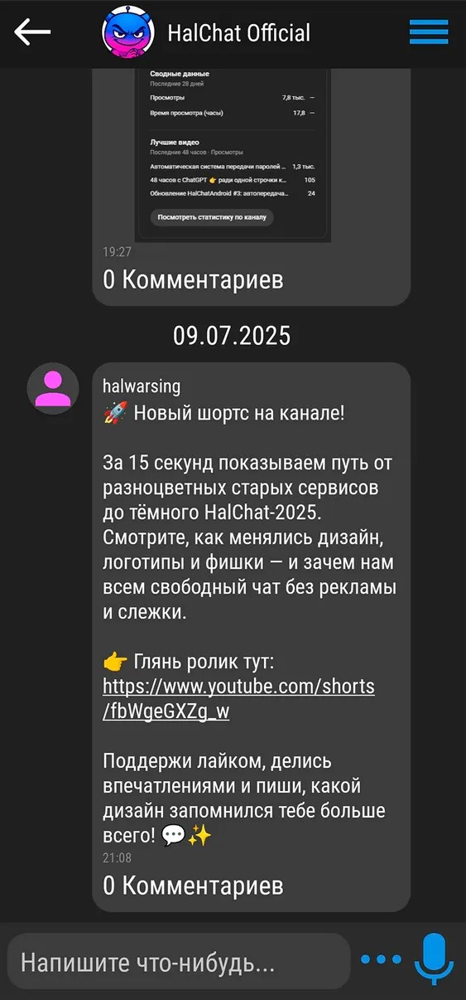
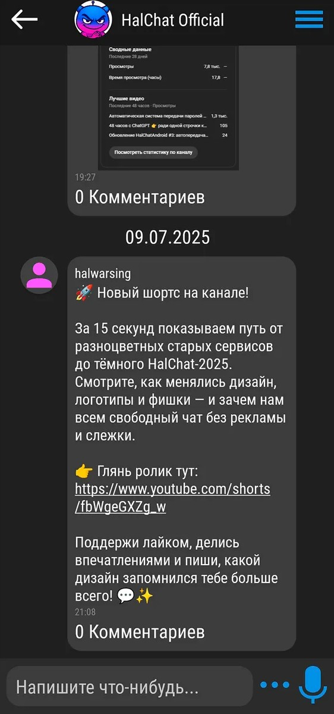

# 📱 HalChat для Android

**HalChat** — доверие строится на независимости. Мессенджер нового поколения: автоматизация, кастомизация и ИИ.

---

## 📥 Доступные платформы

<table>
  <tr>
    <td align="center" valign="middle">
      <a href="https://halch.at/">
         
      </a>
    </td>
    <td align="center" valign="middle">
      <a href="https://play.google.com/store/apps/details?id=halwarsing.net.halchatandroid">
        
      </a>
    </td>
    <td align="center" valign="middle">
      <a href="https://apps.rustore.ru/app/halwarsing.net.halchatandroid">
        
      </a>
    </td>
  </tr>
</table>

---

## ✨ Основные возможности приложения

* **🔑 P2P Синхронизация паролей чатов (RSA-E2EE):** Механизм безопасного централизованного обмена паролями чатов между устройствами пользователей. Подробное описание модели безопасности читайте в [SECURITY.md](SECURITY.md).
* **🛡️ Локальная защита данных (AES-GCM):** Сообщения перед записью в локальную SQLite-базу шифруются по стандарту **AES-256-GCM** с хранением секретных ключей в защищенном аппаратном модуле **Android KeyStore API**.
* **🎙️ Голосовые сообщения:** Запись голосовых сообщений со встроенной плавной визуализацией звуковой волны в реальном времени (`WaveformView`, `RecordedAudioView`).
* **👾 Emoji & Pixel:** Встроенные эмодзи и пиксель-паки для уникального выражения эмоций.
* **🛠️ Каналы, личные чаты и маленькие группы:** Создавай чат под свои нужды.

---

## 🗺️ Дорожная карта переноса (Roadmap) — Нужна помощь сообщества!

Текущая Android-версия — это стабильное работающее ядро (около 30% мессенджера HalChat). Веб-версия HalChat уже полностью доступна для всех [https://halch.at/](https://halch.at/).

Если вы хотите помочь проекту и внести свой вклад в развитие независимой связи, мы будем рады контрибьюторам по следующим направлениям:

- [x] **📌 Закрепленные сообщения и опросы:** Доработка функционала UI чата до полной синхронизации с Web-версией.
- [x] **💡 Реакции:** Реакция на любые сообщения с помощью эмодзи.
- [ ] **🪐 Пространства (Spaces):** Реализация структуры пространств внутри чатов.
- [ ] **🤖 Боты и плагины:** Портирование системы кастомизации и автоматизации чатов.
- [ ] **💬 HalChatMeet:** Публичные чаты и знакомства прямо в приложении.
- [ ] **📱 HalNetMarket:** Маркетплейс кастомизации (плагины, ИИ, пиксели и эмодзи).
- [ ] **📞 Звонки и видеозвонки:** Внедрение LiveKit для голосовых и видеовызовов на Android.
- [ ] **🧠 Интеграция локального ИИ (Local AI):** Перенос локальных ИИ на Android.

Если вы хотите взять задачу в работу — создавайте Issue или присылайте Pull Request!

---

## 🛠️ Архитектура и Технологический стек

* **Язык разработки:** Java (Android SDK)
* **Минимальная версия:** Android 8.0 (API 26) / Target SDK: 35
* **Сетевой слой:** OkHttp 4.x + WebSockets
* **Криптография:**
  * BouncyCastle Provider
  * Android KeyStore API
  * RSA (с OAEP SHA-256) для безопасного обмена ключами чатов
  * AES-256-GCM для защиты локальной базы данных
* **Графика и UI:**
  * Glide
  * Flexbox Layout
  * Custom Views (`ZoomableImageView`, `WaveformView`)

---

## 🚀 Инструкция по сборке

Для сборки проекта вам понадобятся **JDK 11** (или новее) и установленный **Android Studio (Ladybug / Koala)**.

### Сборка через консоль:
1. Клонируйте репозиторий:
   ```bash
   git clone https://github.com/halwarsing/HalChatAndroid.git
   cd HalChatAndroid
   ```
2. Запустите сборку отладочного APK (Debug):
   ```bash
   ./gradlew assembleDebug
   ```
   Готовый файл будет находиться по пути: `app/build/outputs/apk/debug/app-debug.apk`.

3. Запустите тесты:
   ```bash
   ./gradlew test
   ```

---

## 📂 Структура репозитория

```markdown
├── app/
│   ├── src/
│   │   ├── main/
│   │   │   ├── java/halwarsing/net/halchatandroid/
│   │   │   │   ├── encryption/      # Помощники шифрования (AES-GCM, RSA, KeyStore)
│   │   │   │   ├── main/            # Главные активити, сетевые клиенты и логика
│   │   │   │   ├── type/            # Модели данных (HCMessage, HCChat, HCUser и др.)
│   │   │   │   └── views/           # UI-компоненты (Waveform, ZoomImageView)
│   │   │   └── res/                 # Ресурсы разметки (layout), стили и drawable
│   │   └── AndroidManifest.xml      # Конфигурация манифеста и разрешений
│   └── build.gradle.kts             # Скрипт сборки модуля приложения
├── gradle/                          # Конфигурация Gradle wrapper
├── README.md                        # Описание проекта и Roadmap
├── SECURITY.md                      # Политика безопасности и Key Escrow
└── settings.gradle.kts              # Системные настройки проекта
```

---

## 🤝 Вклад в разработку (Contributing)

Мы будем рады любой помощи! Если вы нашли баг или хотите предложить новую фичу:
1. Создайте **Issue** с подробным описанием.
2. Сделайте Fork проекта, создайте ветку `feature/my-cool-feature`.
3. Отправьте **Pull Request** на рассмотрение.

---

## 📬 Соц. сети
* [HalChat](https://halch.at/c/tZgWWT)
* [YouTube](https://www.youtube.com/@halwarsing)
* [Habr](https://habr.com/ru/users/halwarsing/)
* [VK](https://vk.com/halwarsingnet)
* [Telegram](https://t.me/halwarsingchat)

---

## 📬 Контакты
* Email: admin@halwarsing.net
* HalChat: [https://halwarsing.net/id47](https://halwarsing.net/id47)

---

## 📄 Лицензия

Проект распространяется под свободной лицензией **GNU GPLv3**. Подробности смотрите в файле [LICENSE](LICENSE).

---

## 📸 Скриншоты

<p align="center">
  
  &nbsp;&nbsp;&nbsp;&nbsp;
  
</p>